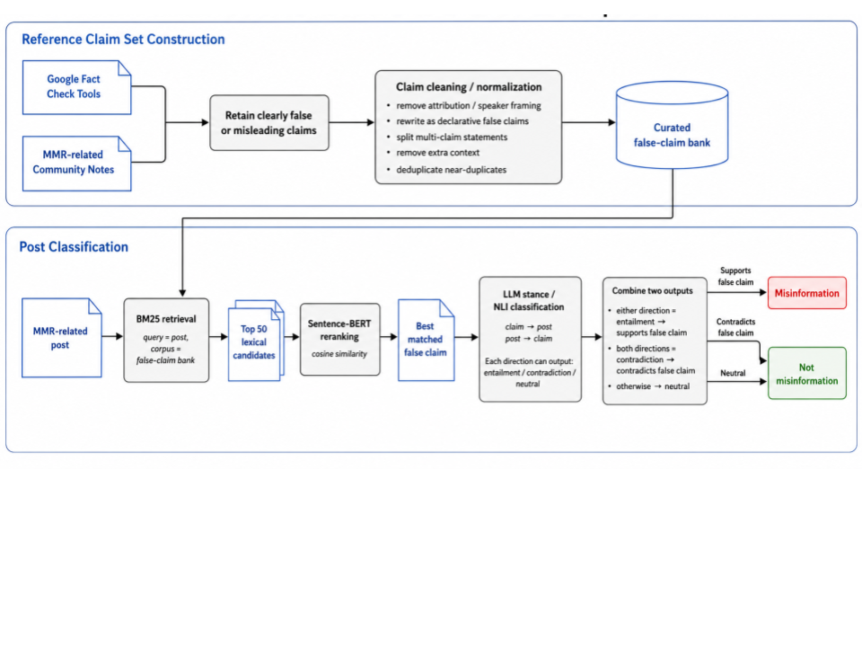
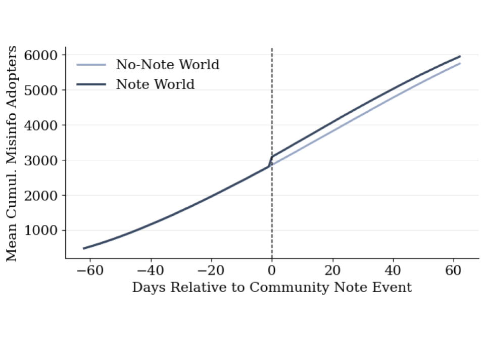

# Community Notes & MMR Misinformation on X

This repository contains the network simulation portion of a larger independent research project examining whether exposure to MMR-related Community Notes on X was associated with changes in user engagement, misinformation sharing, and network-level misinformation diffusion.

The full project asks a broader question: can a platform correction system reduce misinformation, or can visible corrections sometimes produce unintended downstream effects?

## Project Overview

X's Community Notes are designed to add corrective context to misleading posts. Most evaluations of Community Notes focus on the annotated post itself, such as whether engagement with that post decreases after a note appears. This project instead examines downstream viewer behavior: what users do after they appear to encounter a Community Note, whether their later MMR-related posts contain misinformation, and how short-term behavioral changes might scale through a social network.

The project includes two main parts:

1. **User-level analysis**  
   I analyzed MMR-related X posts before and after apparent exposure to MMR-related Community Notes.

2. **Network-level simulation**  
   I built a discrete-time network diffusion simulation to test how the user-level pattern could affect misinformation spread in a larger simulated social network.

This repository shares the network simulation code and final report. Raw X data and identifiable user-level data are not included.

## Research Questions

The full project addressed three research questions:

1. Is exposure to a post with an MMR-related Community Note associated with changes in MMR-related posting activity?
2. Is exposure to a post with an MMR-related Community Note associated with changes in the proportion of misinformation in MMR-related posts?
3. How might the user-level patterns shape the diffusion of MMR-related misinformation at the network level?

## My Role

This was a sole-authored research and data science project. I designed the research questions, reviewed prior literature, collected and cleaned X/Community Notes data, classified MMR misinformation, conducted statistical analyses, built the network simulation, generated figures, and wrote the final report.

The code in this repository focuses on the network simulation component.

## Data and Privacy

The full project used public X Community Notes data and publicly visible X activity related to MMR vaccine discussion. However, raw X data, usernames, tweet IDs, post text, and identifiable user-level data are not included in this repository.

The notebook expects a preprocessed file with user-level exposure timing and misinformation labels. This file is excluded to protect user privacy and avoid reproducing identifiable social media content.

## Misinformation Classification

In the full project, MMR misinformation was identified using a claim-matching and stance-classification pipeline:

1. Curate a reference bank of pre-fact-checked false or misleading MMR claims
2. Clean and normalize false claims
3. Match MMR-related posts to candidate false claims using BM25
4. Re-rank candidate matches using Sentence-BERT cosine similarity
5. Use LLM-based stance classification to determine whether each post supported, rejected, or neutrally referenced the matched false claim
6. Label posts supporting a false claim as misinformation



## Network Simulation

The network simulation tested whether the short-term user-level misinformation spike observed around Community Note exposure could affect broader misinformation diffusion.

The simulation used:

- A Watts-Strogatz small-world graph
- 15,000 simulated users/nodes
- Average degree of 10
- Rewiring probability of 0.1
- Event-time window from 62 days before exposure to 62 days after exposure
- A contagion rate of 0.026
- Initial adopters selected from the top 3% of users by baseline misinformation susceptibility

The model compared two scenarios:

### No-Note World

A counterfactual world where users were not exposed to a Community Note. User susceptibility remained constant, and no day-0 misinformation spike was applied.

### Note World

An exposure world where users had the same baseline susceptibility, but a day-0 spike parameter was applied based on the user-level event-time analysis.

At each time step, active misinformation adopters attempted to influence inactive neighbors. Adoption probability was modeled as:

```text
contagion rate × user susceptibility × spike multiplier
```

Once a node adopted misinformation, it remained active and could continue spreading misinformation in later time steps.

## Key Findings

At the user level, Community Note exposure was not associated with a significant sustained reduction in MMR-related misinformation sharing. However, users showed a short-term spike in both posting activity and misinformation proportion on the day of exposure.

At the network level, the Note world produced more misinformation diffusion than the No-Note world:

| Metric | No-Note World | Note World | Difference |
|---|---:|---:|---:|
| Final misinformation prevalence | 0.3831 | 0.3966 | +0.0134 |
| Peak daily spread | 49.42 new adopters | 274.13 new adopters | +224.72 |
| Total adoption events | 5,296.93 | 5,498.42 | +201.48 |

The simulation suggests that a short-term spike in misinformation sharing can create a small but persistent increase in total misinformation diffusion.



## Tools Used

- Python
- Pandas
- NumPy
- NetworkX
- Matplotlib
- SciPy
- Google Colab

## Files in This Repository

- `network_simulation.ipynb`  
  Code for preparing user-level simulation inputs, generating the small-world network, assigning empirical user attributes, running paired Note vs. No-Note diffusion simulations, visualizing results, and conducting statistical tests.

- `project_report.pdf`  
  Full written report, including literature review, methodology, results, discussion, limitations, ethical statement, and references.

- `requirements.txt`  
  Main Python packages used in the network simulation notebook.

- `figures/`  
  Figures from the final report and simulation output.

## Limitations

This project has several important limitations:

- The real-world X dataset was relatively small, with 95 users and 549 MMR-related posts.
- Exposure to Community Notes was inferred from reply behavior, which does not guarantee that a user actually read the note.
- Misinformation labels relied on automated claim matching and LLM-based stance classification, which may misclassify sarcasm, ambiguity, or context-dependent posts.
- The network simulation used a simulated small-world graph rather than observed follower or interaction networks.
- The simulation is best understood as a proof-of-concept model for exploring possible diffusion effects, not as a direct estimate of real-world platform-wide impact.

## Ethical Note

This project analyzes public social media data, but the topic is sensitive and user content may still be identifiable. For that reason, this repository does not include raw posts, usernames, tweet IDs, or other user-identifying information. Findings are reported in aggregate.

## Project Takeaway

This project shows why platform interventions should be evaluated beyond the corrected post itself. A correction system may reduce engagement with an annotated post while still triggering downstream viewer responses that shape broader misinformation diffusion. The network simulation suggests that even a short-lived behavioral spike can produce a small but persistent increase in misinformation spread.
